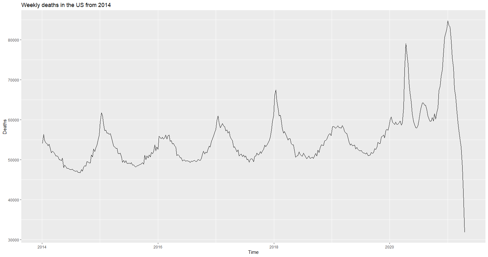
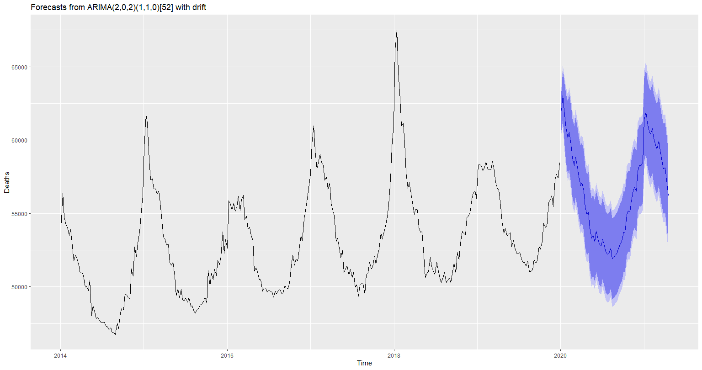
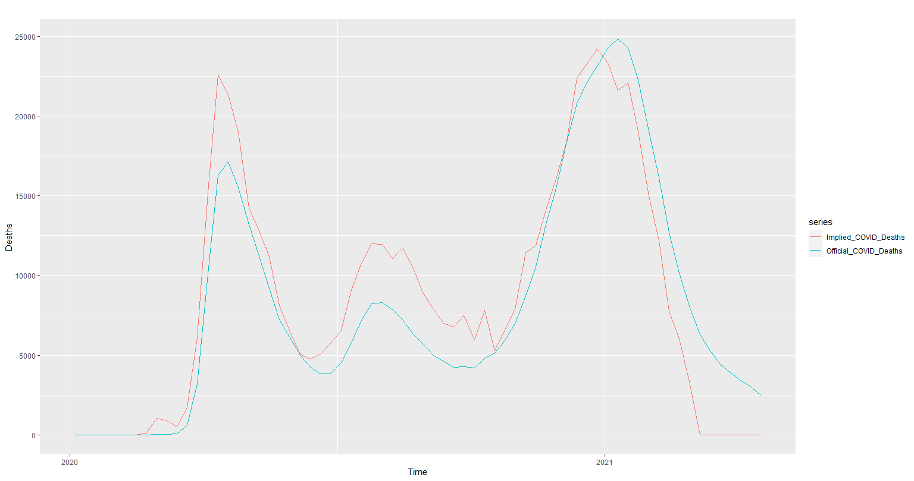
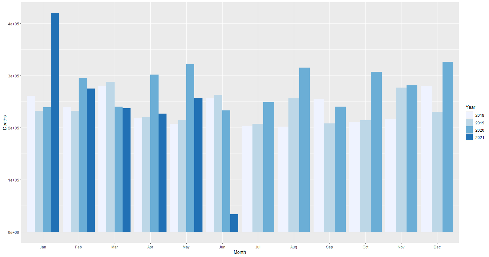
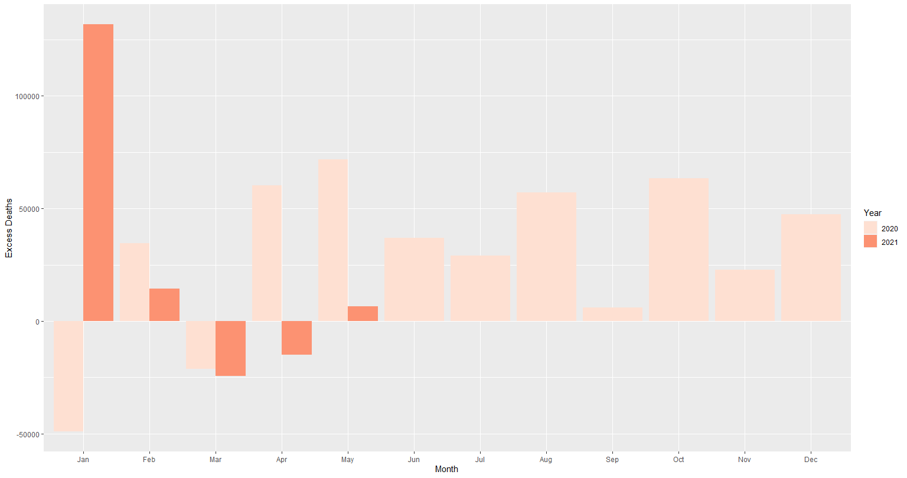
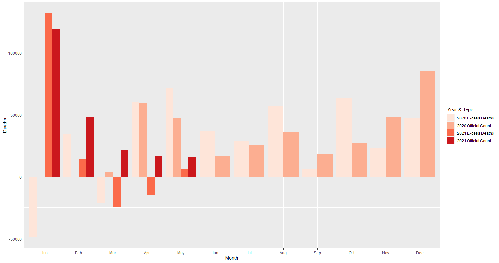

# Are the official COVID-related mortality figures in the US accurate? A forecasting exercise using a seasonal ARIMA model.

Official COVID death statistics can be misleading. Because the symptoms of COVID are very similar to other flu like symptoms, there may have been a large number of people who never got tested for  COVID. Further, even though deaths due to other reasons (say, cardiac arrests) might have been triggered by COVID, they may not be entered in official records as a COVID-related death. For this reason, I use a forecasting exercise to see if the official US COVID death count makes sense. I also include a simpler explanation that can be useful to people without statistical training at the very end of this post. I use the US data for ease of data availability, as the CDC (Centers for Disease Control and Prevention) provides weekly death statistics from 2014 to the present date. 

<aside>
💡 You can find the R code to replicate this analysis in the 'Code' folder of this repo.

</aside>
<br>

The exercise proceeds follows: 

- I train a seasonal ARIMA model on United States data up to 2019.

- Then, I forecast death count for 2020 and 2021, up to the present date. Because COVID spread to the US in 2020, data up to 2019 can be used to forecast deaths in 2020 to find the counterfactual: would could the death count have been had COVID not occurred?

- Subtracting this forecasted death count from the actual death count in 2020 and 2021 gives us what is often called "excess deaths" — because excess deaths could have only occurred due to COVID (since that's the only thing that could have modified death counts between end of 2019 and 2020), this can be taken as the death count implied by actual mortality rates. I call this figure **"Implied COVID Related Deaths".**
  
  <aside>
    💡 Implied COVID Related Deaths = (Actual Deaths) - (Forecasted Deaths)
  
  </aside>
  <br>

- Finally, comparing the implied COVID deaths to official COVID deaths from the same data source gives us an estimate of how much we're underreporting or overreporting COVID deaths.

---

### Sections

- Loading the required modules, data and data cleaning
- Model Validation
- Forecasting deaths in 2020 and 2021, using data up to 2019
- Getting `Implied COVID deaths` and comparing this with `Official COVID Deaths`
- A simpler exercise

---

### Loading the required modules, data and data cleaning

```r
if (!require(pacman)) {
  install.packages("pacman")
}

library("pacman")

pacman::p_load(RSocrata, lubridate, forecast, tseries, dplyr, ggplot2)
```

We use data from the CDE. They provide an API to access the data. The package `RSocrata` allows us to use this API easily. The below code fetches the data, cleans it up and then converts it into a time series object.

- Code:
  
  ```r
  # Fetch data from CDS, USA using the API they provided
  
  # Data for 2014 - 2019: we need this for prediction
  data1419 <- read.socrata("https://data.cdc.gov/resource/3yf8-kanr.json",)
  
  # Data from 2020 - present
  data20p <- read.socrata("https://data.cdc.gov/resource/muzy-jte6.json",)
  
  # Let us now prepare the data
  
  # Data for 2014 - 2019
  
  x <- data1419
  x <- x[x$jurisdiction_of_occurrence == "United States",] #We only need data for the US as a whole
  x <- x[,c("weekendingdate", "allcause")] #We only need these two columns
  colnames(x) <- c("Week Ending Date", "Deaths") #Rename coluimns
  data1419c <- x #Cleaned Data
  
  # Repeat for Data from 2020
  
  x <- data20p
  x <- x[x$jurisdiction_of_occurrence == "United States",] #We only need data for the US as a whole
  x <- x[,c("week_ending_date", "all_cause")] #We only need these two columns
  colnames(x) <- c("Week Ending Date", "Deaths") #Rename coluimns
  data20pc <- x #Cleaned Data
  
  # From the 2020-present data, we also need COVID death counts
  
  x <- data20p
  x <- x[x$jurisdiction_of_occurrence == "United States",] #We only need data for the US as a whole
  x <- x[,c("week_ending_date", "covid_19_u071_multiple_cause_of_death")] #We only need these two columns
  colnames(x) <- c("Week Ending Date", "COVID Deaths")
  coviddata <- x
  
  # Putting the 2014-2019 and 2020-present datasets together
  
  data <- rbind(data1419c, data20pc)
  
  # Clean up the environment
  rm(data1419, data1419c, data20p, data20pc, x)
  
  # Converting data into time series data
  
  deaths <- as.numeric(data$Deaths)
  deaths_start <- decimal_date(ymd(data$`Week Ending Date`[1]))
  covid_deaths <- as.numeric(coviddata$`COVID Deaths`)
  covid_deaths_start <- decimal_date(ymd(coviddata$`Week Ending Date`[1]))
  
  deaths <- ts(data = deaths, start = deaths_start, freq=365.25/7)
  covid_deaths <- ts(data = covid_deaths, start = covid_deaths_start, freq = 365.25/7)
  ```

We see that the weekly data shows considerable seasonality in the US. Particularly, the first week of each year seems to have a high death count. Post the first week, deaths decrease and start picking up pace by June or July. This means we'll have to use a model that takes into account this seasonality.



---

### Model Validation

I first train the model using data up to 2018, and then test the forecasted results with data from 2019. I get a **M**ean **A**verage **P**ercentage **E**rror (MAPE) of about 11%, which is indeed not a small forecasting error. Other models such as TBATS and STL models gave a lesser forecastig error at about 10%. However, for our purposes, this model is currently sufficient; it is more interpretable and by no means nullifies the exercise. Further, note that this is significantly better than simply taking the number of deaths in the same week of the previous year (this is referred in the industry as a *seasonal naïve forecast).*

The auto-fitted ARIMA model does include a seasonality term. We can verify that the model does indeed pick up seasonality by plotting the forecasts, which we do in the next section.

- Code
  
  ```r
  # Forecast Deaths using Seasonal ARIMA --------------------------------------------
  
  # Since we observe seasonality, we will use a seasonal ARIMA model to forecast deaths
  # The auto.arima() function tries to detect seasonality automatically
  
  # First, let's split the dataset into train and test data sets so that we can first see if our model is good enough to be used for this exercise
  
  train <- data[data$`Week Ending Date` < as.Date("2019-01-01"),]
  test <- data[data$`Week Ending Date` > as.Date("2018-12-31"),]
  
  train <- as.numeric(train$Deaths)
  test <- as.numeric(test$Deaths)
  
  train <- ts(data = train, start = decimal_date(ymd("2014-01-04")), freq = 365.25/7)
  test <- ts(data = test, start = decimal_date(ymd("2019-01-05")), freq = 365.25/7)
  
  # Fit an ARIMA model on the train data
  
  arima_train <- auto.arima(train)
  predictions <- forecast(arima_train, h = length(test), level = c(90, 95))
  autoplot(predictions) #Our model accurately picks up seasonality
  
  # Let's compare the predicted death counts to actual death counts
  
  predictions <- as.numeric(predictions$mean)
  test <- as.numeric(test)
  df <- data.frame(predictions, test)
  df$diff <- abs(predictions - test) / test
  mean(df$diff)
  
  # We have a MAPE (Mean Absolute Percentage Error) of 11% 
  ```

---

### Forecasting deaths in 2020 and 2021, using data up to 2019

Finally, I use data up to 2019 to forecast deaths in 2020-2021. Data up to 2019 would not have picked up COVID signals, so the forecasts based on this data presents us with a useful counterfactual as to what would have happened without COVID. In the next section, I compare this with actual death counts to get the `Implied COVID Deaths`

- Code
  
  ```r
  # Fit an ARIMA model to the data
  # Because we want to compare forecasted deaths to actual deaths, 
  # I train the model upto 2019 and forecast for 2020 to 2021
  
  deaths_u2019 <- data[data$`Week Ending Date` < as.Date("2020-01-01"),"Deaths"]
  deaths_u2019 <- as.numeric(deaths_u2019)
  deaths_u2019 <- ts(data = deaths_u2019, start = decimal_date(ymd("2014-01-04")), freq = 365.25/7)
  
  deaths_a2019 <- data[data$`Week Ending Date` > as.Date("2019-12-31"),"Deaths"]
  deaths_a2019 <- as.numeric(deaths_a2019)
  deaths_a2019 <- ts(data = deaths_a2019, start = decimal_date(ymd("2020-01-04")), freq = 365.25/7)
  
  arima <- auto.arima(deaths_u2019)
  forecasted_deaths <- forecast(arima, h = length(covid_deaths), level = c(90, 95))
  autoplot(forecasted_deaths)
  ```



Note how the model picks up seasonality quite well.

---

### Getting `Implied COVID Deaths` and comparing this with `Official COVID Deaths`

Implied COVID deaths are simply the difference between actual deaths and the forecasted deaths (that were forecasted using data up to 2019). 

- Code
  
  ```r
  # Let us know get Implied COVID deaths by taking the difference of actual deaths and forecasted deaths
  forecasted_deaths <- as.numeric(forecasted_deaths$mean)
  actual_deaths <- as.numeric(deaths_a2019)
  
  Implied_COVID_Deaths <- actual_deaths - forecasted_deaths
  sum(Implied_COVID_Deaths)
  sum(covid_deaths)
  
  Implied_COVID_Deaths[Implied_COVID_Deaths < 0] <- 0
  sum(Implied_COVID_Deaths)
  
  Implied_COVID_Deaths <- actual_deaths - forecasted_deaths
  
  Implied_COVID_Deaths <- ts(Implied_COVID_Deaths, start = decimal_date(ymd("2020-01-04")), freq = 365.25/7)
  Implied_COVID_Deaths[Implied_COVID_Deaths < 0] <- 0
  Official_COVID_Deaths <- covid_deaths
  ```

Sometimes, implied COVID deaths is negative, which can happen if our forecasted death is higher than actual deaths. I also estimate a different figure by replacing these negative numbers with 0. Further, the same dataset also provides us with the official COVID deaths statistics for each week. I summarize the findings below:

- Implied COVID Deaths = 516930.9
- Implied COVID Deaths (after replacing negative numbers with 0) = 589511.1
- Official COVID Deaths = 556264

Here is a plot comparing `Implied COVID Deaths` and `Official COVID Deaths`:



There is not much different between these numbers, leading us to conclude the COVID death statistics given by the US does make plenty of sense. 

---

### A simpler exercise

Here, I attempt to do the above in a manner that is accessible to more people. The message can be sent across by simply comparing deaths in a year-on-year manner (i.e., compare the deaths in April, 2021 or 2022 to, say, deaths in April 2019). 

First, let's combine the weekly data into monthly data. Comparing year on year data for 52 weeks can get clumsy very quickly.

- Code
  
  ```r
  # "Data" contains weekly data from 2014. We're going to aggregate by month.
  
  data$Year <- year(data$`Week Ending Date`)
  data$Month <- month(data$`Week Ending Date`)
  
  # Group by and sum
  data$Deaths <- as.numeric(data$Deaths)
  monthly_data <- data %>% group_by(Year, Month) %>% dplyr::summarise(Deaths = sum(Deaths, na.rm = T))
  monthly_data <- monthly_data[, c(2,1,3)]
  monthly_data$Month <- factor(month.abb[monthly_data$Month],levels=month.abb)
  monthly_data$Year <- as.character(monthly_data$Year)
  
  # To make the graph neater, let's only keep the data from 2018
  monthly_data <- monthly_data[monthly_data$Year == "2018" | monthly_data$Year == "2019" | monthly_data$Year == "2020" | monthly_data$Year == "2021",]
  
  ggplot(monthly_data, aes(fill=Year, y=Deaths, x=Month)) + 
    geom_bar(position="dodge", stat="identity") + scale_fill_brewer(palette="Blues")
  ```



In the graph above, the bars for 2018 and 2019 would be what we consider as the "baselines" number of deaths in that particular month. We can see that the values for 2020 and 2021 are usually higher than the figures for 2018 & 2019. This is what call the excess deaths due to COVID, or, as used in the blog post, `Implied COVID deaths`. Comparing these "excess deaths" to official COVID figures would tell us if those figures underestimate or overestimate COVID deaths. We do that now. First, let's plot by excess deaths by month in 2020-21 by taking the difference between the death counts in those years and the average of the figures in 2018 and 2019 (our "baselines")

- Code
  
  ```r
  # To make the graph neater, let's only keep the data from 2018
  monthly_data <- monthly_data[monthly_data$Year == "2018" | monthly_data$Year == "2019" | monthly_data$Year == "2020" | monthly_data$Year == "2021",]
  
  ggplot(monthly_data, aes(fill=Year, y=Deaths, x=Month)) + 
    geom_bar(position="dodge", stat="identity") + scale_fill_brewer(palette="Blues")
  
  monthly_data2 <- monthly_data
  monthly_data2$Year[monthly_data2$Year == "2018"] <- "2019"
  
  baseline <- monthly_data2 %>% group_by(Month) %>% dplyr::summarise(Baseline = mean(Deaths))
  
  monthly_data3 <- monthly_data[monthly_data$Year == "2020" | monthly_data$Year == "2021",]
  monthly_data3 <- monthly_data3[1:17,]
  monthly_data3$Deaths <- monthly_data3$Deaths - baseline$Baseline
  excess_deaths <- monthly_data3
  p <- ggplot(excess_deaths, aes(fill=Year, y=Deaths, x=Month)) + 
    geom_bar(position="dodge", stat="identity") + scale_fill_brewer(palette="Reds")
  
  p
  ```



The plot above shows the "excess deaths" (`Implied COVID deaths`) by month for 2020 and 2021. We can compare this with official COVID deaths in those months. Let's add those figures in the same plot:

- Code
  
  ```r
  # Adding official COVID deaths to the plot
  
  # Group by and sum
  
  coviddata$Year <- year(coviddata$`Week Ending Date`)
  coviddata$Month <- month(coviddata$`Week Ending Date`)
  
  coviddata$`COVID Deaths` <- as.numeric(coviddata$`COVID Deaths`)
  monthly_coviddata <- coviddata %>% group_by(Year, Month) %>% dplyr::summarise(Deaths = sum(`COVID Deaths`, na.rm = T))
  monthly_coviddata <- monthly_coviddata[, c(2,1,3)]
  monthly_coviddata$Month <- factor(month.abb[monthly_coviddata$Month],levels=month.abb)
  monthly_coviddata$Year <- as.character(monthly_coviddata$Year)
  
  monthly_covid_2020 <- filter(monthly_coviddata, Year == "2020")
  monthly_covid_2021 <- filter(monthly_covid_2021, Year == "2021")
  monthly_covid_2020$`Year & Type` <- "2020 Official Count"
  monthly_covid_2021$`Year & Type` <- "2021 Official Count"
  monthly_covid_2021 <- filter(monthly_covid_2021, Month != "Jun")
  excess_deaths$`Year & Type` <- paste(excess_deaths$Year, "Excess Deaths")
  colnames(excess_deaths) <- c("Month", "Year", "Deaths", "Year & Type")
  
  exvoff <- rbind(excess_deaths, monthly_covid_2020, monthly_covid_2021)
  
  pp <- ggplot(exvoff, aes(fill=`Year & Type`, y=`Deaths`, x=Month)) + 
    geom_bar(position="dodge", stat="identity") + scale_fill_brewer(palette="Reds")
  
  pp
  ```



We observe that the excess deaths, in some cases, are higher than the official (COVID)death count while in other cases they're lower than the official (COVID) death count. In some cases, the two figures match quite well (for example: in April 2020, the two figures are almost the same; they're quite close in July 2020 and January 2021 as well).

In fact, if the sum of the difference between excess deaths (over the baseline of the average of 2018 and 2019 deaths) and the official COVID death counts is actually negative — more so in 2021. This could point to many things. One interpretation could be that overall mortality itself is somehow lower in 2021 (March & April) because of a combination of a few factors factors:

- Lesser unvaccinated high-risk population means lower COVID deaths
- General safety and cleanliness practices might have reduced mortality through other causes.
- Reduced outdoor activities could have reduced mortality through accidents

While this reasoning warrants more introspection, there is reason to believe that the official US COVID death count is rooted in reality. 
